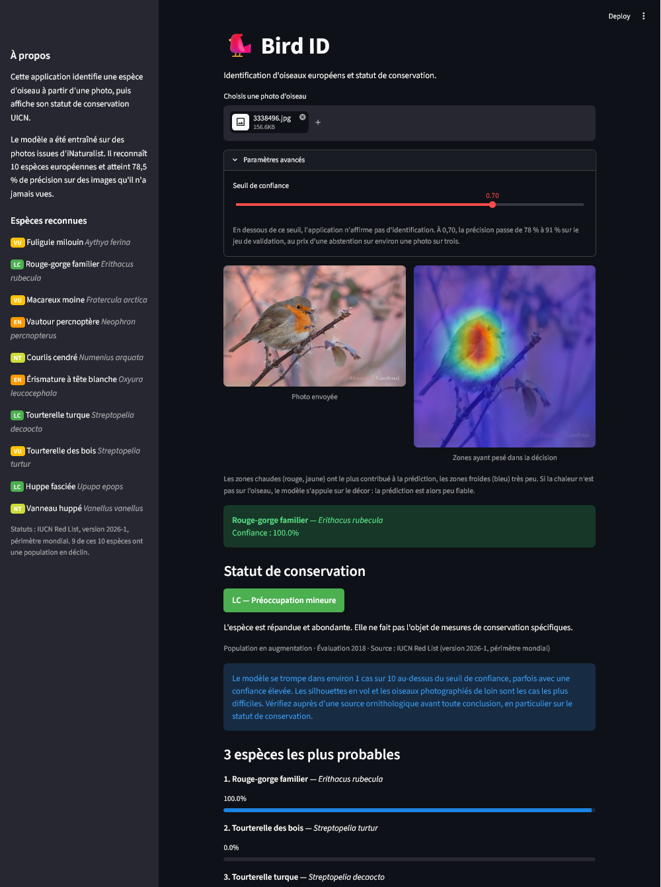
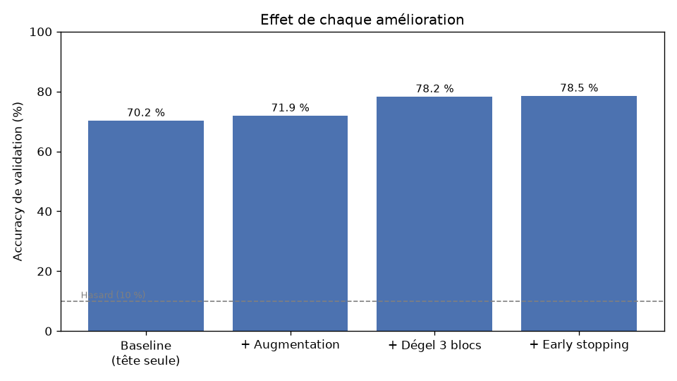
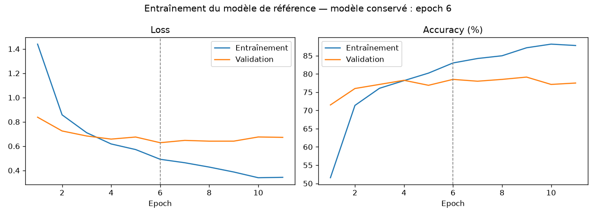
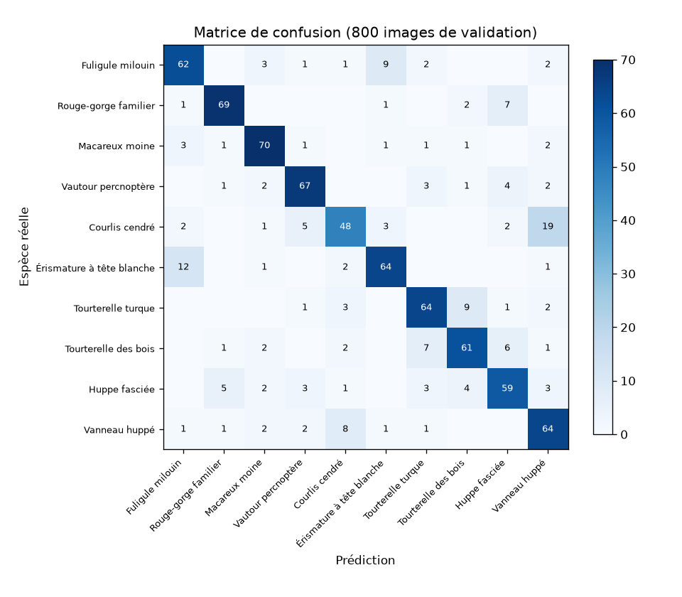

# 🐦 Bird ID

**[→ Tester l'application en ligne] (https://birdid-louisemurarasu.streamlit.app/)**

Application qui identifie 10 espèces d'oiseaux européens à partir d'une photo,
affiche leur statut de conservation UICN, et montre sur quoi le modèle s'est basé
pour décider.

Projet de portfolio orienté **Green Coding** : chaque choix technique est
documenté et justifié, y compris son coût de calcul.



## Résultats

| Métrique | Valeur |
|---|---|
| Accuracy (top-1) | 78,5 % |
| Accuracy (top-3) | 94,3 % |
| Accuracy avec seuil de confiance 0,70 | 91,3 % sur 69 % des photos |
| Paramètres entraînés | 654 890 sur 1,5 M |
| Durée d'entraînement | ~5 min sur CPU |



## Fonctionnalités

- Identification à partir d'une photo, avec les 3 espèces les plus probables
- Statut de conservation UICN avec tendance de population
- **Seuil de confiance** : l'application s'abstient plutôt que de produire une
  identification peu fiable
- **Grad-CAM** : carte de chaleur montrant les zones qui ont pesé dans la décision

## Espèces reconnues

| Espèce | Nom scientifique | Statut UICN |
|---|---|---|
| Rouge-gorge familier | *Erithacus rubecula* | LC |
| Huppe fasciée | *Upupa epops* | LC |
| Tourterelle turque | *Streptopelia decaocto* | LC |
| Vanneau huppé | *Vanellus vanellus* | NT |
| Courlis cendré | *Numenius arquata* | NT |
| Tourterelle des bois | *Streptopelia turtur* | VU |
| Fuligule milouin | *Aythya ferina* | VU |
| Macareux moine | *Fratercula arctica* | VU |
| Vautour percnoptère | *Neophron percnopterus* | EN |
| Érismature à tête blanche | *Oxyura leucocephala* | EN |

**Neuf de ces dix espèces ont une population en déclin.**

## Démarche

### Choix du modèle

MobileNetV3-Small (2,5 M de paramètres) plutôt que ResNet50 (25,6 M) : entraînement
sur CPU, prédiction rapide, et compatibilité avec une exécution embarquée.

Seule la couche de classification et les 3 derniers blocs du réseau sont entraînés,
soit **654 890 paramètres sur 1,5 M**. Le reste conserve les caractéristiques
visuelles apprises sur ImageNet.

### Progression mesurée

| Expérience | Accuracy validation |
|---|---|
| Baseline (couche finale seule) | 70,2 % |
| + Data augmentation | 71,9 % |
| + Dégel des 3 derniers blocs | 78,2 % |
| + Early stopping | 78,5 % |



La loss de validation atteint son minimum à l'epoch 6 puis remonte, alors que
l'accuracy reste plate. L'early stopping conserve le modèle de l'epoch 6 :
l'écart entre entraînement et validation passe de 12,8 à 4,5 points.

### Erreurs



Trois paires concentrent l'essentiel des erreurs :

- **Courlis cendré / Vanneau huppé** : les deux espèces les plus photographiées de
  loin. Grad-CAM montre que le modèle se rabat alors sur le décor.
- **Fuligule milouin / Érismature à tête blanche** : deux canards, toujours sur
  l'eau.
- **Tourterelle turque / Tourterelle des bois** : deux espèces du même genre. Cette
  confusion est la plus problématique, puisqu'elle oppose une espèce commune à une
  espèce vulnérable.

### Explicabilité

Grad-CAM a permis de tester une hypothèse : le vautour percnoptère, photographié
presque toujours en vol sur fond de ciel, était-il reconnu grâce au décor ?

**Non.** Les zones chaudes suivent l'oiseau, et notamment le contraste entre les
extrémités d'ailes sombres et le corps clair — le critère même qu'utilisent les
ornithologues.

En revanche, sur une photo où l'oiseau est minuscule, le modèle s'appuie sur la
végétation environnante. La prédiction peut être correcte pour une mauvaise raison.

## Installation

```bash
git clone https://github.com/LouiseMurarasu/bird-id.git
cd bird-id
python -m venv .venv
.venv\Scripts\Activate.ps1        # Windows
pip install -r requirements.txt
```

PyTorch s'installe ici en version CPU. Pour l'obtenir explicitement :

```bash
pip install torch torchvision --index-url https://download.pytorch.org/whl/cpu
```

### Reconstituer le dataset

Les images ne sont pas versionnées : elles appartiennent à leurs auteurs. Les
scripts les retéléchargent depuis iNaturalist.

```bash
python scripts/check_species.py      # vérifie la disponibilité des photos
python scripts/download_images.py    # télécharge 400 photos par espèce (~1h30)
python scripts/split_dataset.py      # sépare en 80 % train / 20 % validation
python scripts/train.py              # entraîne le modèle (~5 min)
python scripts/evaluate.py           # matrice de confusion
```

### Lancer l'application

```bash
streamlit run app.py
```

## Structure

bird-id/
├── app.py Application Streamlit
├── birdid.py Modèle, transformations, données partagées
├── config/ Espèces et statuts UICN
├── scripts/ Pipeline de données, entraînement, évaluation
├── docs/ Justification de chaque décision technique
└── results/ Journaux d'entraînement, matrices, figures

## Documentation

| Document | Contenu |
|---|---|
| [`docs/experiments.md`](docs/experiments.md) | Journal des 4 expériences avec analyse |
| [`docs/dataset-analysis.md`](docs/dataset-analysis.md) | Audit visuel manuel des 4000 images |
| [`docs/dataset-split.md`](docs/dataset-split.md) | Choix du découpage train/validation |
| [`docs/model-choice.md`](docs/model-choice.md) | Choix de MobileNet et coût de calcul |
| [`docs/data-augmentation.md`](docs/data-augmentation.md) | Transformations retenues et écartées |
| [`docs/training-strategy.md`](docs/training-strategy.md) | Dégel, early stopping, checkpointing |
| [`docs/explainability.md`](docs/explainability.md) | Analyse Grad-CAM |
| [`docs/confidence-threshold.md`](docs/confidence-threshold.md) | Calibration du seuil |
| [`docs/iucn-data.md`](docs/iucn-data.md) | Provenance des statuts de conservation |

## Limites connues

- Le modèle se trompe dans environ 1 cas sur 10 au-dessus du seuil de confiance,
  parfois avec une confiance élevée. Les silhouettes en vol sont un cas difficile.
- Le modèle répond toujours parmi les 10 espèces connues, même pour une photo qui
  n'en contient aucune.
- Les statuts UICN sont mondiaux et figés à la version 2026-1. Une espèce peut
  avoir un statut régional différent.
- Le seuil est calibré sur le jeu de validation, qui a servi à sélectionner le
  modèle : la valeur est probablement un peu optimiste.

## Perspectives

### La vision à long terme

Ce projet est la première brique d'un objectif plus large : un **boîtier autonome
de jardin**, équipé d'une caméra et d'un microphone, capable de reconnaître et de
compter les oiseaux qui passent.

Cet objectif explique plusieurs choix déjà faits :

| Choix | Raison dans la perspective embarquée |
|---|---|
| MobileNetV3-Small (2,5 M de paramètres) | Doit tenir et tourner sur un petit appareil, sans GPU |
| Prédiction locale, sans appel réseau | Un boîtier de jardin ne peut pas dépendre d'une connexion |
| Statuts UICN en fichier local | Même raison : fonctionnement hors ligne |
| Seuil de confiance | Un système autonome doit pouvoir dire « je ne sais pas » plutôt que de fausser un comptage |

### Améliorations du modèle

**Travailler sur les erreurs identifiées.** L'analyse Grad-CAM a montré que les
confusions viennent principalement de photos où l'oiseau est trop petit. Deux
pistes : filtrer ces images du jeu d'entraînement, ou en télécharger davantage
pour les espèces concernées (courlis, vanneau).

**Dégeler davantage de blocs** (7 à 12 plutôt que 10 à 12), en surveillant le
surapprentissage désormais détecté par l'early stopping.

**Ajouter des espèces.** L'architecture le permet sans modification : la liste est
dans `config/species.json`, et le nombre de classes s'en déduit.

### Apprentissage continu

Dans la version embarquée, un oiseau non reconnu — confiance sous le seuil — serait
**enregistré plutôt qu'ignoré**. Une interface web permettrait ensuite de :

- consulter les détections récentes et leurs Grad-CAM
- corriger une identification erronée
- étiqueter les cas où le modèle a refusé de répondre

Ces corrections alimenteraient un jeu d'entraînement enrichi de données réelles,
prises dans les conditions exactes d'utilisation, plutôt que de photos de
naturalistes. Le modèle s'améliorerait donc sur le terrain où il travaille
vraiment.

### Reconnaissance sonore

Le chant est souvent plus discriminant que l'image pour identifier un oiseau, et il
fonctionne de nuit comme derrière un feuillage. Ce serait un second modèle, entraîné
sur des spectrogrammes, dont les prédictions viendraient croiser celles de l'image.

C'est un chantier à part entière, hors du périmètre de ce projet.

## Sources et licences

**Images** : iNaturalist, observations Research Grade sous licence CC0, CC-BY ou
CC-BY-NC. Les crédits par photo sont enregistrés dans `data/raw/attributions.csv`
au téléchargement.

**Statuts de conservation** : IUCN 2026. IUCN Red List of Threatened Species.
Version 2026-1. www.iucnredlist.org — relevés manuellement, périmètre mondial.

**Modèle pré-entraîné** : MobileNetV3-Small, poids ImageNet via torchvision.